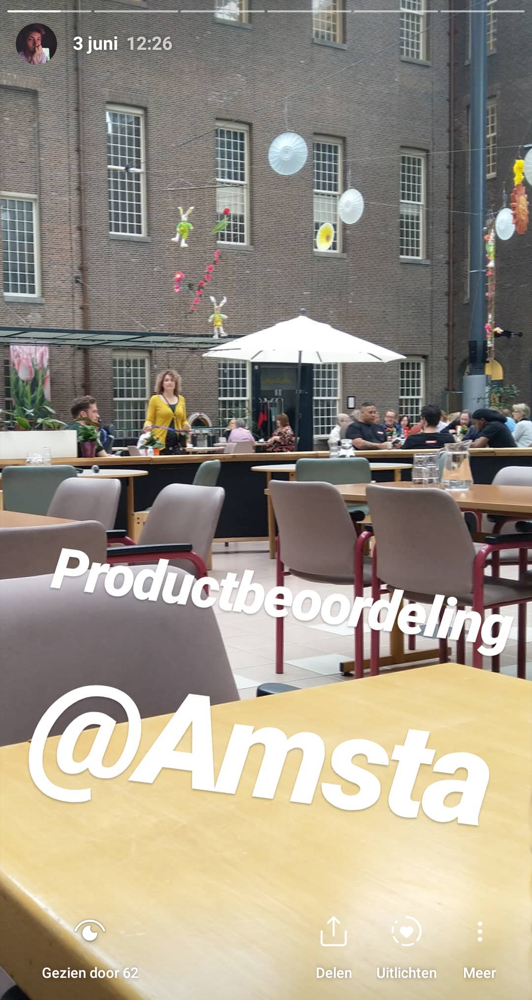
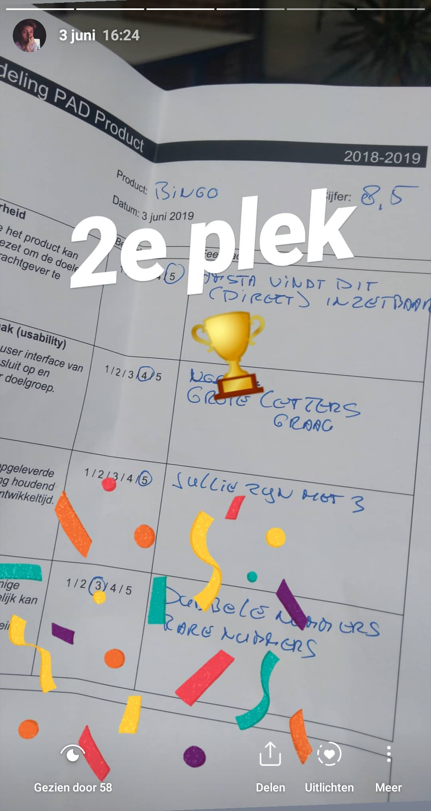
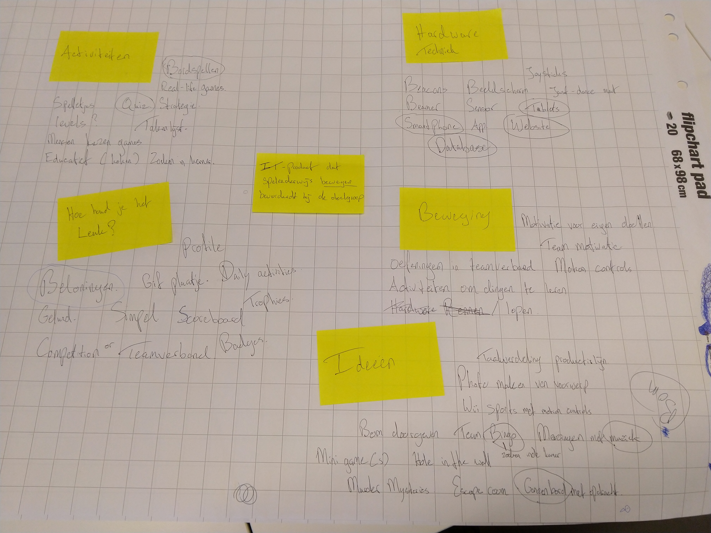
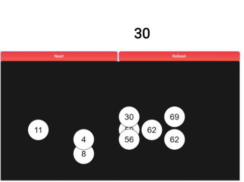
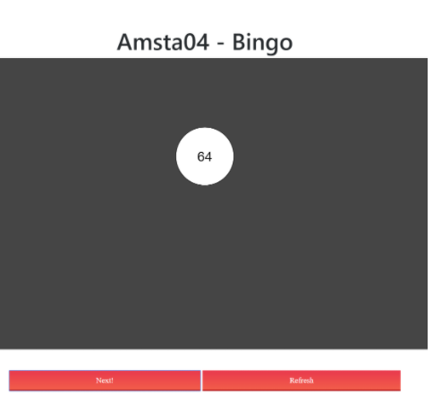
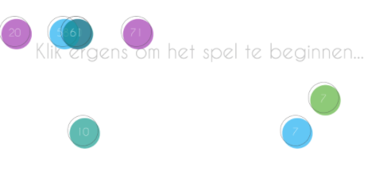
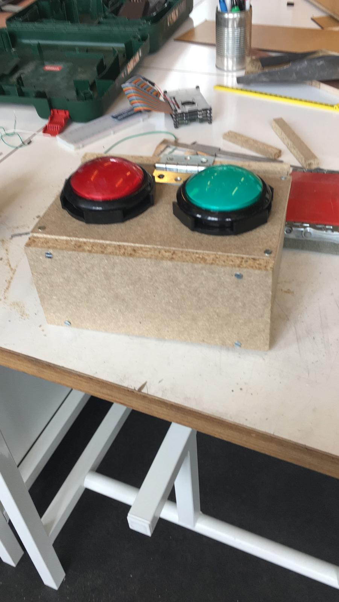

# Amsta bingo

## Introductie video :film_projector:

De opvolger van het eerste project Fasten your seatbelts, project agile development.
Met als opdracht "Ontwikkel een IT-Product dat spelenderwijs bewegen bevorderdt bij de doelgroep", mochten wij een applicatie maken voor bewoners van [Amsta](https://www.amsta.nl/) met het [Korsakov](https://www.alzheimer-nederland.nl/dementie/soorten-vormen/korsakov) syndroom
Dit is het eerste project waar we in een scrum team hebben gewerkt.

## :sparkles: Startup

In deze sprint hebben we user research gedaan naar de gebruikers van de applicatie. We hebben ons ingelezen op de doelgroep en het Korsakov syndroom. We hebben gekeken waar de gebruiker wel en niet toe in staat is en hoe we daar ons product op kunnen aanpassen. Omdat Korsakov patienten problemen hebben met geheugen en opstart en afremmen van gedrag, hebben we besloten om  de applicatie zo simpel mogelijk te houden.

Brainstorm!

Tijdens de brainstorm sessie hebben we gekozen om 
bingo te maken met fysieke knoppen als bewegingselement.

## Sprint 1 - Demo

Al snel hadden we een werkende tech-demo die we konden laten zien in de sprint demo van sprint 1. Deze demo liet zien wat de mogelijkheden waren in “Processing”, een javascript library. De demo liet een paar balletjes stuiteren binnen een scherm en liet de balletjes trekken functionaliteit zien. Het spel was weliswaar speelbaar, omdat het (op een basis manier) bingo simuleerde.
 

## Sprint 2 - Architectuur

In sprint 2 ben ik mij gaan focussen op een echte game architectuur in het project. Het spel bestond voorheen uit losse javascript, html en css bestanden. In deze sprint heeft mijn game development excellentie mij geholpen. Ik heb alle game elementen geconverteerd naar klassen en het complete project heringericht. Aan de hand van de theorie van mijn excellentie, heb ik de basis van game states en de “StateSwitcher” klasse toegevoegd aan het project. States worden gebruikt om game componenten te groeperen in bepaalde states waarin het programma zich kan bevinden. Zo heeft de “PlayingState” bijvoorbeeld de lijst met bingoballetjes en een ronde nummer, terwijl de “IntroState” alleen de variabelen van het openingsscherm bevat. De “StateSwitcher” wordt gebruikt om tussen deze states te navigeren. Ook heb ik een generiek “GameObject” klasse gemaakt waar alle visuele game objecten op kunnen extenden. Deze klasse bevat een aantal vectoren die positie op het scherm en beweging van een object kan bijhouden en manipuleren. Aan het eind van sprint 2 hadden we een demo die met de herinrichting van het project werkte, niet veel verandering aan de front-end, maar een compleet nieuwe back-end

## Sprint 3 - Link met knoppen

Sprint 3 was een beetje chaotisch. De sprint zelf had maar 2 bijeenkomsten waarvan de laatste de demo, dus er moest veel thuis gemaakt worden. In deze sprint was het doel om de knoppen te linken aan het programma, in conclusie, dit is toen niet gelukt. Maar er is zeker een poging getracht, waar vele uren aan besteed waren. Tevens heb ik deze sprint het gehele project van laravel (PHP framework) omgezet naar NodeJS (Javascript framework). Dit bracht de totale omvang van het project van zo’n 50 Mb naar ongeveer 8 Mb en kwam met een heldere mappenstructuur in tegenstelling tot de (vrijwel ongebruikte) laravel structuur. Tevens heb ik in deze sprint het introscherm toegevoegd, dit was voornamelijk om iets nieuws te laten zien tijdens de sprint demo

## Sprint 4 - Link met knoppen

In sprint 4 heb ik mij voornamelijk bezig gehouden om de knoppen te linken aan het systeem. Dit heb ik uiteindelijk opgelost door de via python de druk op de knop op te vangen, dit naar de database te versturen en via een rest api via javascript de database uit te lezen via ajax calls. Weliswaar een omweg, maar mijn hoogste prioriteit op dat moment was het werkend krijgen van deze communicatie.

## Sprint 5 - Unit tests

In sprint 5 heb ik mijn unit tests geschreven, de applicatie werkte vrijwel en mensen die nog niet veel hadden gecodeerd hadden in deze sprint de tijd om een stukje bij te benen.
